<p align="center">
  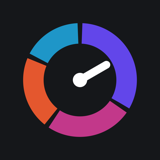
</p>

<h1 align="center">Hourfolio</h1>

<p align="center">
  <b>Your time, invested.</b><br>
  A time portfolio for people with many hobbies. Every hobby is an asset, hours are the currency, and rest counts as an investment too.<br>
  <sub>iOS · English, Українська, Polski · local-first, no account</sub>
</p>

<p align="center">
  
  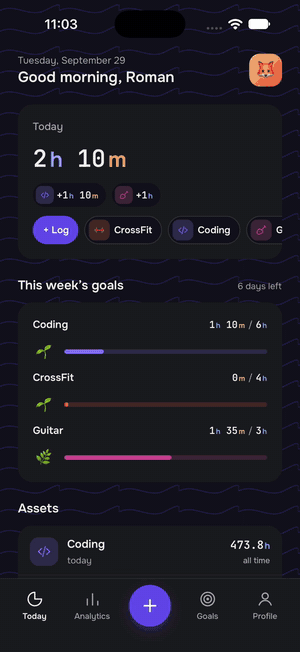
  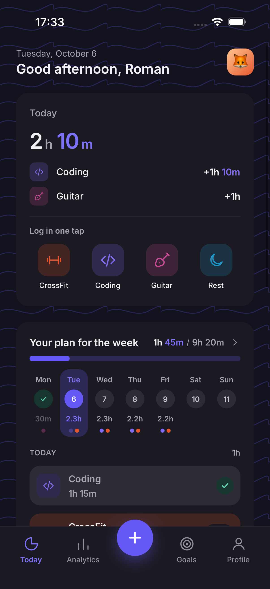
</p>

## Why

Most habit apps reward one thing done every day and punish breaks with broken streaks. People with a guitar, a gym routine, a side project and a stack of books to read end up feeling behind on all of them.

Hourfolio does the opposite. It shows how your time is spread across everything you care about, and it never makes you feel guilty about it:

- No streaks, and no red numbers.
- A hobby on a break is **resting**, not failing.
- Rest is an asset in every portfolio.
- Reminders only ever say "you're nearly there" or "rest counts too". They never say "you missed".

## How it works

| | |
|---|---|
| **Capital** | Every hour you have put into a hobby, including the years before the app. It never goes down. |
| **Momentum** | Recent activity on a 0–100 scale. It fades during a break but never drops below 20, and it decays at each hobby's own rhythm (daily, a few times a week, weekly, whenever). |
| **Recovery** | In every portfolio. Rest days show up as their own thing, not as gaps. |
| **Energy balance** | Your time split into body, creative, mind and recovery. |
| **Weekly goals** | Optional. Progress is drawn as a small scene, like a tree growing or a dog running to its bone, and it only ever moves forward. |
| **Weekly plan** | Optional. Spreads your weekly goals over the days you are free, so you know what to do when. |

## A tour

### Today and this week
The first screen shows today and this week, not a chart. It has what you did today, a row of one-tap tiles for what you usually do, your plan for the week (a progress bar, hours for each day and today's sessions as tiles in each hobby's color), and every asset with its capital. Weekly goals live on the Goals tab. On an empty morning it asks "What are you investing in today?" instead of showing a zero.

<p align="center">
  
  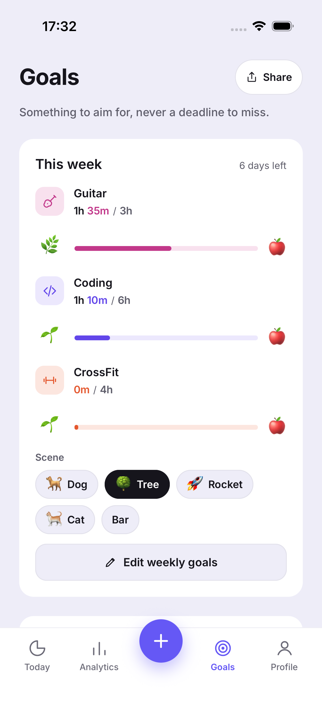
  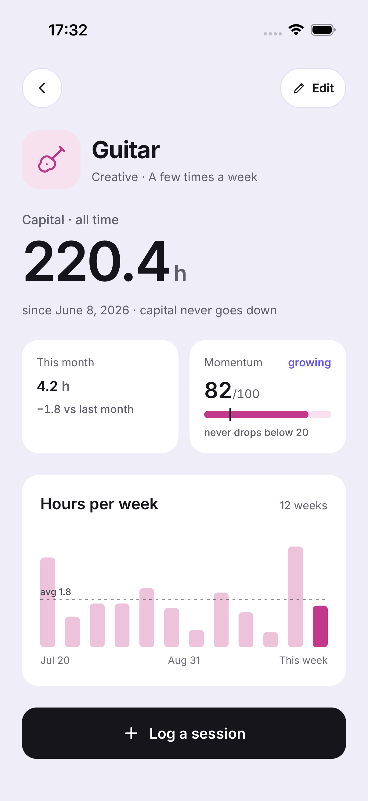
</p>

### Plan your week
Tell the app how much time you can give each day and it spreads your weekly goals over those days. Say you want 5 hours of CrossFit, 3 of guitar and 2 of DJing, and weekends are busy: CrossFit goes on every weekday, the rest is mixed in around it, and something is planned each day. Free weekends get the longer sessions instead.

- **Sessions fit the activity:** reading splits into short 20–30 minute bites, a workout gets a longer block, and a big goal stretches the sessions rather than losing time.
- **Rhythm:** the same asset isn't put on back-to-back days when it can be avoided. Each asset can be limited to some weekdays (CrossFit not on weekends) in its editor.
- **Rest is optional:** add recovery minutes if you want them, or leave them out.
- **Adjust before saving:** move a session a day earlier or later, or remove it.
- **No guilt:** time that doesn't fit is just said plainly, and a missed session quietly moves on when you re-plan the rest of the week.
- **Where it shows:** Today has the week as a strip with each day's hours, and today's sessions as tiles with a "Log" chip. Goals has the whole plan, with "Re-plan the rest" and "Edit plan" buttons. Without a plan, Today offers to make one. On a Sunday it plans the next week.
- **Goals and plan stay in step:** after you change weekly goals, the app offers to re-plan the rest of the week.
- **Reminder (optional):** one note in the late afternoon about what is planned and not done yet, for today and tomorrow.

<p align="center">
  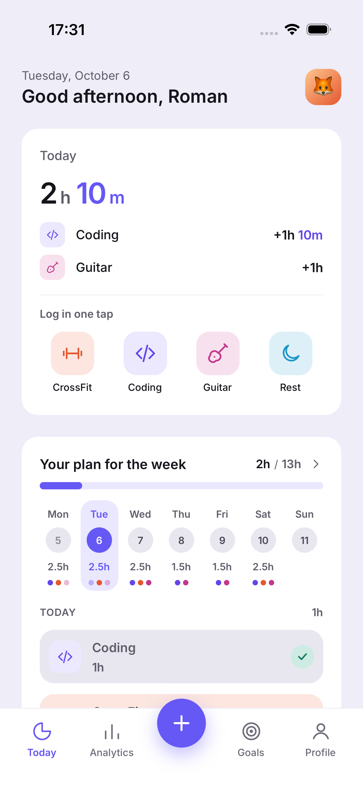
  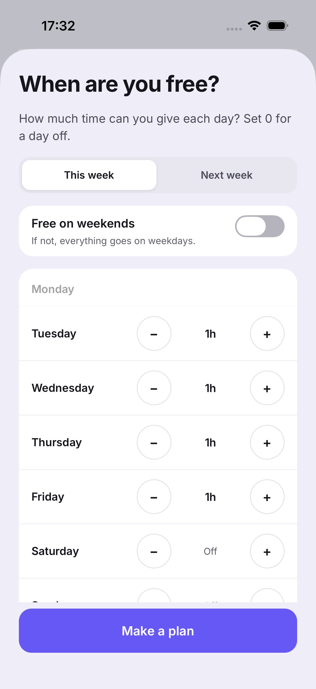
  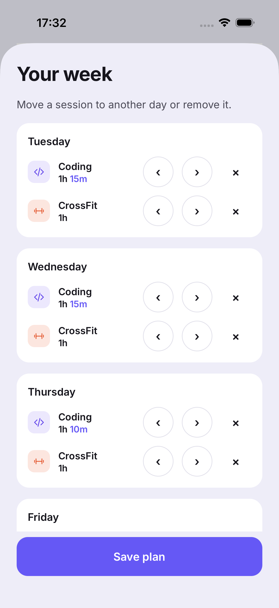
  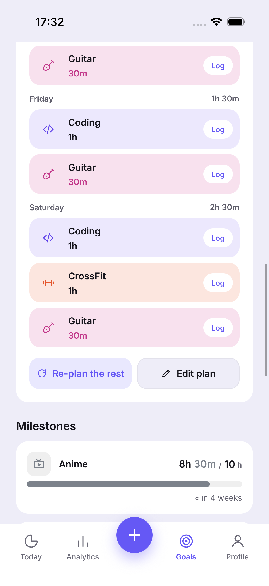
</p>

### Analytics
The charts live one tab over:
- hours for the week, month, year or all time, against the previous period;
- time allocation;
- per-asset trends;
- energy balance and a monthly calendar where recovery days have their own color.

<p align="center">
  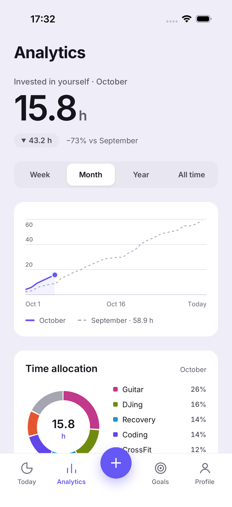
</p>

### Goals you want to share
Finishing a weekly goal opens a congrats screen with confetti and a share card, rendered as a PNG for Telegram, Threads, Instagram or anywhere else. There's also a "My week" card.

<p align="center">
  
  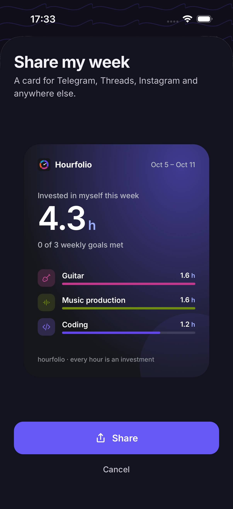
</p>

### Make it yours
- **Profile:** a preset character or your own photo as your picture.
- **Appearance:**
  - light, dark or system mode;
  - any accent color from the full iOS color picker;
  - any page color, with text and cards adjusting to stay readable;
  - eight background patterns.
- **Assets:** each one can show an icon, an emoji (a full picker with search in all three languages) or a photo of your own guitar.
- **Units:** hours, minutes and days keep their colors whatever you pick.

<p align="center">
  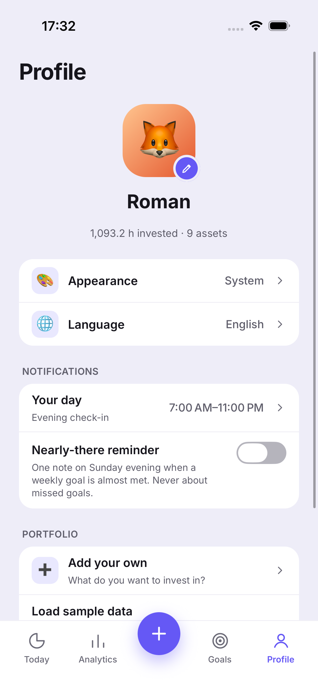
  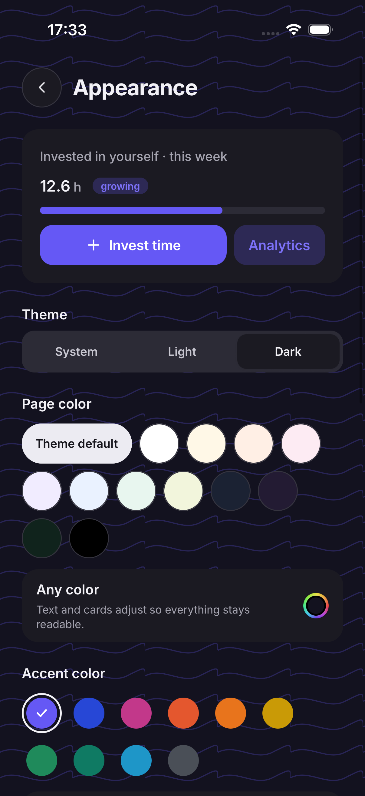
</p>

Holidays dress the app up. From mid-October the accent turns pumpkin, the scenes get holiday props, and you can switch to a holiday app icon, or have it switch by itself.

<p align="center">
  
  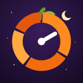
  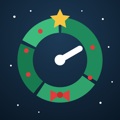
</p>

### Onboarding and gentle reminders
0. Three quick looks at the app after a few months of use: plan your week, see your progress, see your investment. Swipe through or skip.
1. Pick from 35 activities or add your own.
2. Tune each one: a picture (an icon from the app, an emoji or your own photo), color, how often you do it, starting capital (a quick pick or any number of hours) and an optional weekly goal in half-hour steps, with a live preview of its scene.
3. Tell the app when your day starts and ends.
4. Add a name, picture and color (optional).

There are three reminders, all off until you turn them on:
- **Evening check-in:** one note an hour before bed, only on days with nothing logged yet.
- **Nearly-there reminder:** one note on Sunday when a weekly goal is almost met.
- **Planned sessions:** one note in the late afternoon about what your plan has for today and tomorrow.

The app starts in your phone's language (English if it isn't one of the three) and there is no language question up front. Change it any time in Profile.

<p align="center">
  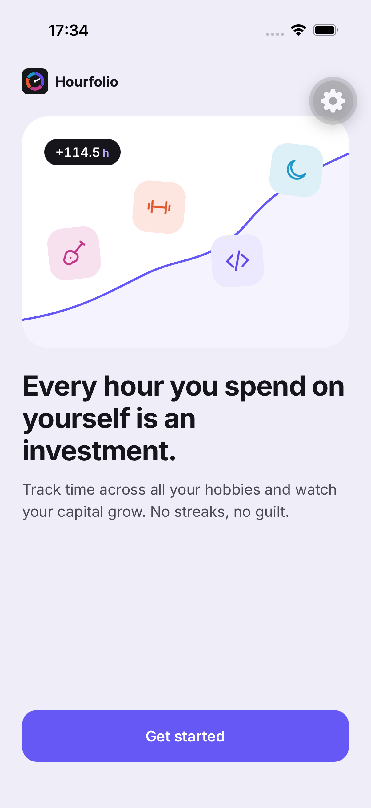
  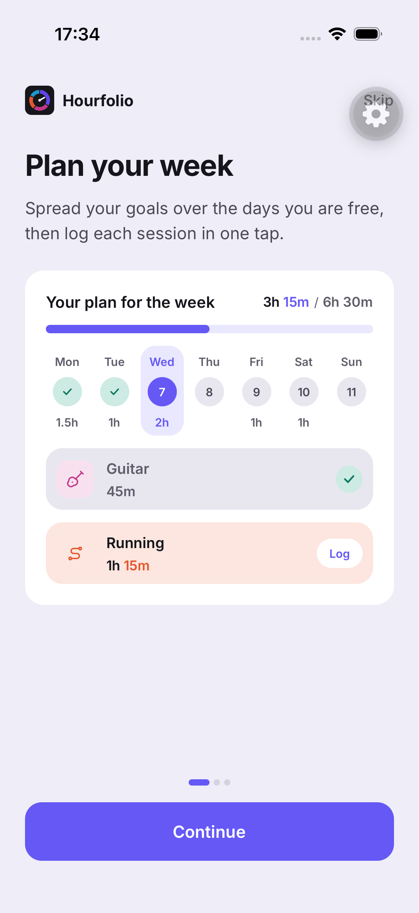
  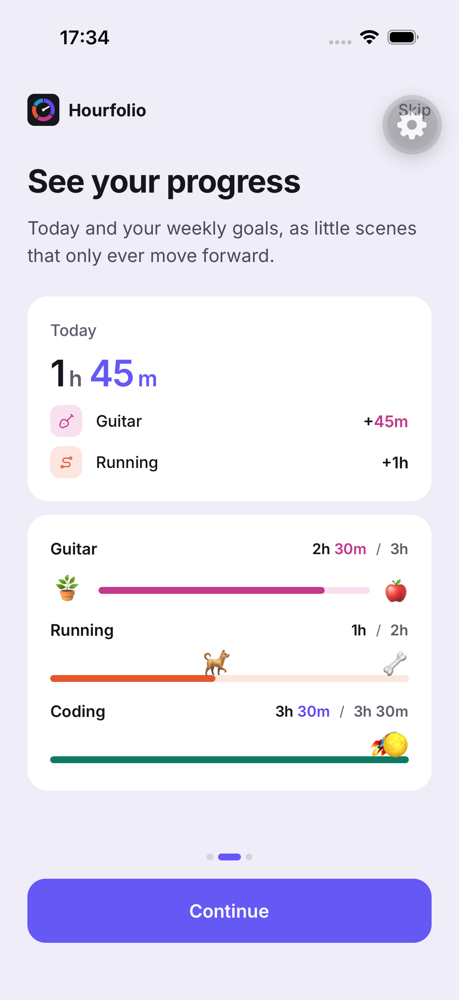
  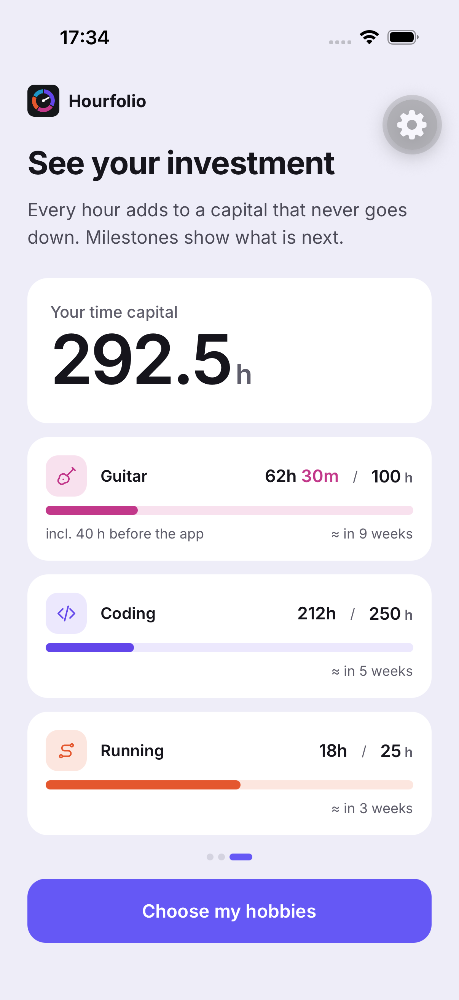
</p>

<p align="center">
  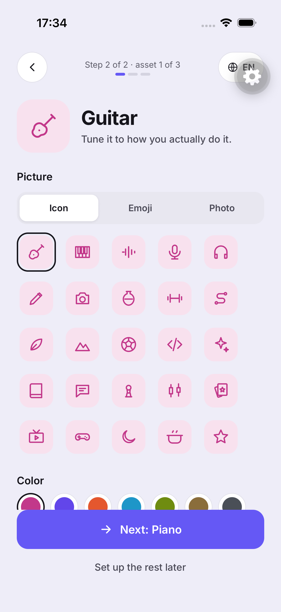
  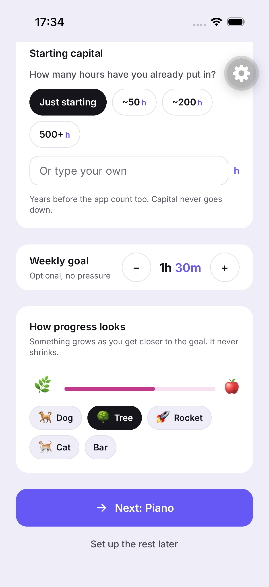
  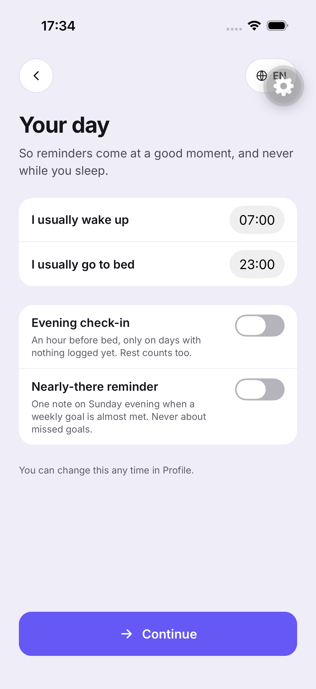
  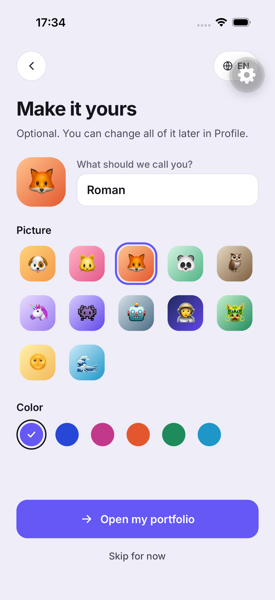
</p>

## Stack

Expo SDK 57 · React Native 0.86 · expo-router · TypeScript (strict) · Restyle (theme built at runtime) · zustand + MMKV · i18next · react-native-svg + Reanimated · @expo/ui (native color and time pickers) · expo-notifications (local only) · Jest · Maestro

```
src/
  domain/      pure logic, unit-tested: growth (capital, momentum), stats, goals and scenes,
               the weekly planner, the day and reminders, seasons, colors and contrast, emoji search
  store/       zustand stores persisted to MMKV
  i18n/        EN / UK / PL, checked for missing keys and plural forms
  theme/       buildTheme({ mode, accent, page }); fixed colors for hours, minutes and days
  components/  UI building blocks, charts, goal scenes, share cards, confetti
  app/         expo-router screens
  data/        emoji data built from emojibase (scripts/build-emoji.mjs)
plugins/       config plugins: UIScene for the iOS 27 SDK, no push entitlement
e2e/           Maestro flows, which also take the screenshots in this README
```

## Run it

You need [mise](https://mise.jdx.dev) (it pins Node 22 and bun), Xcode and an iOS simulator. MMKV needs native code, so this runs as a dev build, not in Expo Go.

```sh
mise install
mise exec -- bun install
mise exec -- bun run ios        # build and launch on the simulator
mise exec -- bun run test       # unit tests
mise exec -- bun run typecheck
mise exec -- bun run lint
```

To try it with data, go to Profile → Load sample data (it includes a plan for the week).

End-to-end flows run with [Maestro](https://maestro.dev): `maestro test e2e/onboarding.yaml`, then `e2e/tour.yaml` (it loads sample data and saves screenshots to `e2e/screenshots/`).

## Built with AI

This app is also a hands-on way to learn AI-assisted development with Claude Code. Each piece is in the repo:

| Piece | Where | What it does here |
|---|---|---|
| Project memory | [`CLAUDE.md`](CLAUDE.md) | Commands, layout and product rules such as "no guilt" and "tokens, never hex" |
| Skills | [`.claude/skills/`](.claude/skills) | `new-screen` (how a screen is built in this app), `on-device` (build and run on a real iPhone) and `create-pr` (checks and PR description) |
| Hooks | [`.claude/settings.json`](.claude/settings.json) | Lint and typecheck after every edit, so mistakes come back straight away |
| MCP | [`.mcp.json`](.mcp.json) | Maestro, so Claude can drive the simulator, check screens and take these screenshots |
| Subagents | in the session | Research on how other apps design their first screen, run in the background |
| Artifacts | claude.ai | Mockups of three home screen directions, to pick one before building |

The plan and the reasoning behind decisions are in [`docs/PLAN.md`](docs/PLAN.md).

## License

Copyright (c) 2026 Roman Blyztsiv. All rights reserved. See [`LICENSE`](LICENSE): the code may not be copied, modified or distributed without written permission.
